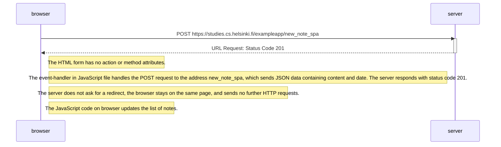

```
sequenceDiagram
    participant browser
    participant server

    browser->>server: POST https://studies.cs.helsinki.fi/exampleapp/new_note_spa
    activate server
    server-->>browser: URL Request: Status Code 201
    deactivate server

    Note right of browser: The HTML form has no action or method attributes.
    Note right of browser:The event-handler in JavaScript file handles the POST request to the address new_note_spa, which sends JSON data containing content and date. The server responds with status code 201.
    Note right of browser:The server does not ask for a redirect, the browser stays on the same page, and sends no further HTTP requests.
    Note right of browser: The JavaScript code on browser updates the list of notes.
```

